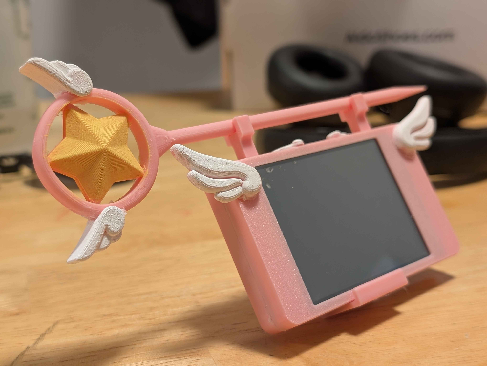

# Cardcaptor Sakura Smart Display

A custom Wi-Fi desktop tracker and clock featuring a Cardcaptor Sakura themed 3D-printed enclosure. This repository contains the code and STL files needed to build your own.

---

## Previews

Here is what the finished product looks like:




---

## Hardware and Bill of Materials

### Required Hardware
* **Display Module:** Freenove 2.8 Inch Display [Freenove Store - FNK0114](https://store.freenove.com/products/fnk0114)
* **Fasteners:** 4 x M3x12 screws (required to secure the 3D-printed enclosure plates together)

> **Important Note on Hardware:** If you purchase or use a different screen variant, model, or size than the FNK0114 display used here, you will need to modify the main sketch configuration and the display driver libraries to match your specific hardware parameters (such as the controller chip, pinouts, and screen resolution).

---

## Setup and Configuration

Before uploading the firmware to your microcontroller, you need to configure your network credentials and local time settings inside the main sketch file (`Cat_Plant_Clock.ino`).

### 1. Wi-Fi Configuration
Open `Cat_Plant_Clock.ino` and locate the **Wi-Fi Credentials** section near the top. Replace the placeholder text with your actual network details:

```cpp
// --- Wi-Fi Credentials ---
const char* ssid     = "YOUR_SSID";
const char* password = "YOUR_PASSWORD";

```

### 2. Time Zone and Location Settings

The display automatically syncs with an internet time server (NTP). To ensure it displays the correct local time for your specific area, you must update the time offset variables in `Cat_Plant_Clock.ino`:

```cpp
// --- Time Sync Configuration ---
const char* ntpServer = "pool.ntp.org";
const long  gmtOffset_sec = -25200;    // Mountain Standard Time (Edmonton)
const int   daylightOffset_sec = 3600; // 1 hour for Daylight Saving Time

```

* **`gmtOffset_sec`**: Calculate your base time zone offset from UTC/GMT in seconds. Multiply your time zone's hourly offset by 3600. For example:
* GMT-7 (Mountain Standard Time): `-7 * 3600 = -25200`
* GMT-5 (Eastern Standard Time): `-5 * 3600 = -18000`
* GMT+1 (Central European Time): `1 * 3600 = 3600`


* **`daylightOffset_sec`**: If your region observes Daylight Saving Time (DST), set this to `3600` (which adds 1 hour during summer months). If your region does not use daylight saving time, change this value to `0`.

---

## Repository Structure

* `/STL` - Contains all 3D model files required to print the enclosure and decorative components.
* `/Images` - Contains preview images of the project layout.
* Core firmware source code files:
* `Cat_Plant_Clock.ino`
* `display.cpp`
* `display.h`
